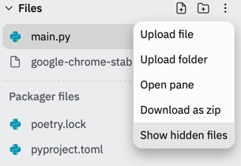
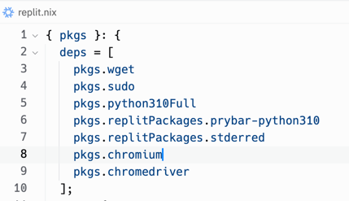

# Scraper
1. pip install bs4 requests selenium
2. in replit, click the three veritcal dots in the file pane and then click 
   `Show hidden files`.
   
3. Open the `replit.nix` file and add `pkgs.chromium` and `pkgs.chromedriver`
   to the `deps` array.  
   
4. Update `main.py` with
   ```python
   from selenium import webdriver
   from selenium.webdriver.chrome.options import Options
   from selenium.webdriver.common.by import By
   from selenium.webdriver.common.keys import Keys
   
   chrome_options = Options()
   chrome_options.add_argument('--no-sandbox')
   chrome_options.add_argument('--disable-dev-shm-usage')
   
   driver = webdriver.Chrome(options=chrome_options)
   driver.get("https:/google.com")
   
   ## Finding Elements
   
   google_text = driver.find_element(By.CLASS_NAME, "MV3Tnb").text
   
   print(google_text)
   
   input_box = driver.find_element(By.NAME, "q")
   
   ## Typing and Clicking
   
   input_box.send_keys("Hi")
   
   input_box.send_keys(Keys.ENTER)
   
   home_link = driver.find_element(By.ID, "logo")
   
   home_link.click()
   
   ## Selectors
   
   tag_search = driver.find_element(By.TAG_NAME, "a").text
   
   print(tag_search)
   
   link_text = driver.find_element(By.LINK_TEXT, "About").text
   
   print(link_text)
   ```

